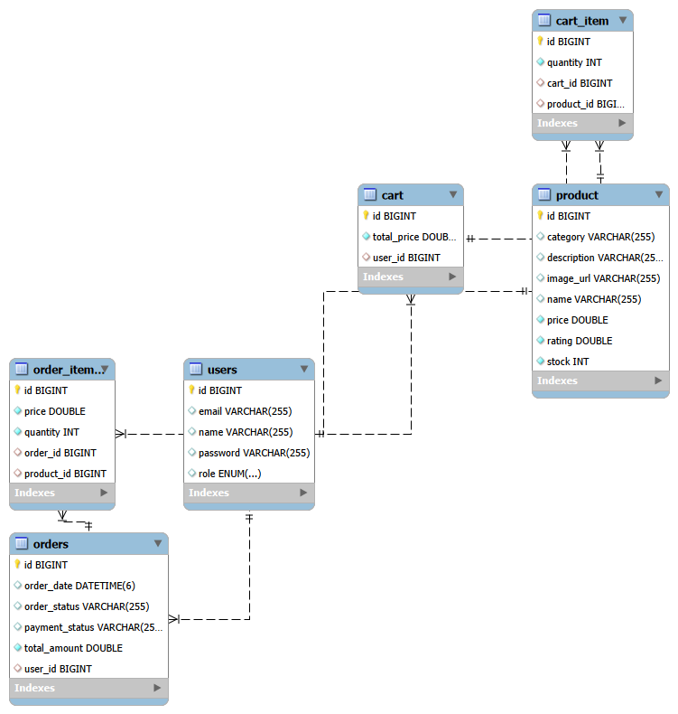

# ecommerce-backend
Production-grade E-Commerce Backend built using Spring Boot, MySQL, JWT Security and REST APIs.
# E-Commerce Backend System

## Project Overview

This project is a production-grade backend system for an E-Commerce platform built using Java and Spring Boot.

It manages:

- Users
- Products
- Shopping Cart
- Orders
- Payments
- Inventory

The backend exposes REST APIs which can be consumed by web or mobile applications.

---

## Tech Stack

- Java 17
- Spring Boot 3
- Spring Security (JWT Authentication)
- Spring Data JPA / Hibernate
- MySQL
- Maven
- Swagger UI
- JUnit & Mockito
- SLF4J Logging

---

## Project Architecture

The project follows a layered architecture:

Controller → Service → Repository → Entity

Packages used:

- controller
- service
- repository
- entity
- dto
- exception
- config
- security
- utils

---
## Database Design

The system database consists of the following entities:

- User
- Product
- Cart
- CartItem
- Order
- OrderItem

---

## Database ER Diagram



---

## Features

### User Management

- User registration
- Login using JWT authentication
- Update user profile
- Role-based access (ADMIN, CUSTOMER)

### Product Management

- Add products (Admin)
- Update products (Admin)
- Delete products (Admin)
- View product list
- Pagination support

### Shopping Cart

- Add product to cart
- Update quantity
- Remove product
- View cart

### Order Management

- Checkout
- View order history
- Update order status

### Payment Simulation

- Simulated payment success or failure

### Inventory Management

- Automatic stock reduction after order
- Prevent ordering when stock is unavailable

---

## How to Run Locally

1. Clone the repository

```
git clone https://github.com/Aka05prad/ecommerce-backend.git
```

2. Navigate to project folder

```
cd ecommerce-backend
```

3. Run the application

```
mvn spring-boot:run
```

Application will start at:

```
http://localhost:8080
```

Swagger API documentation:

```
http://localhost:8080/swagger-ui/index.html
```

---


---

## API Documentation

Swagger UI:

http://localhost:8080/swagger-ui.html

Postman collection is included in the project.

---

## Testing

Service layer tested using JUnit and Mockito.

Test Coverage:-

- Class Coverage: 85.7%
- Method Coverage: 65.7%
- Line Coverage: 70%

---
## Docker Support
Rebuild the Docker image:-

copy in ubuntu LTS terminal to run

- docker build -t ecommerce-backend .

Run the container again:-

- docker run -p 8080:8080 ecommerce-backend .

---

## Author

Akankshya Pradhan 
Trainee